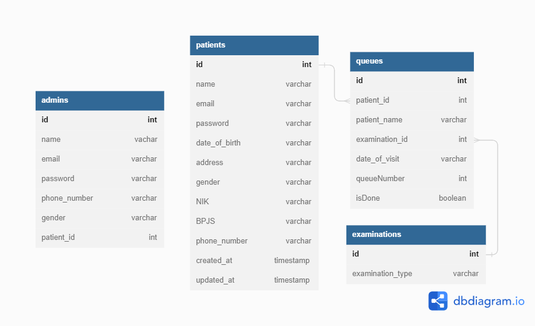

# MP-AntrianDokter-BE

Members 👨‍👧‍👧 :

```
- Safira Tyas Wandita 👩
- Siti Haryati 👩

```

## 🚀Features

Patient :
```
✔️Post Login (with Token)
✔️Post Register
✔️Get Whoami (with Token)
✔️Put Detail Patient (with Token)
✔️Get PatientId (with Token Admins)
✔️Get AllPatients (with Token Admins)
```
Admins :
```
✔️Post Login (with Token)
✔️Post Register
✔️Get Whoami (with Token)
✔️Put UpdateBookingId (with Token)
✔️Put Detail Admins (with Token)
✔️Get AdminsId (with Token Admins)
✔️Get AllAdmins (with Token Admins)
```
Queues :
```
✔️Post BookingNumber (with Token)
✔️Delete BookingNumber (with Token Admins)
✔️Get BookingId (with Token Admins)
✔️Put UpdateBookingId (with Token Admins)
✔️Get AllBookings (with Token Admins)
✔️Get HistoryPatient (with Token Patient)
```

Examinations :
```
✔️Get ExaminationsId (with Token)
✔️Get AllExaminations (with Token)
```
## 🔍Endpoints

```javascript
const endpoint = "https://mediq-backend.herokuapp.com/";
```

## 📌Entity Relationship Diagram


